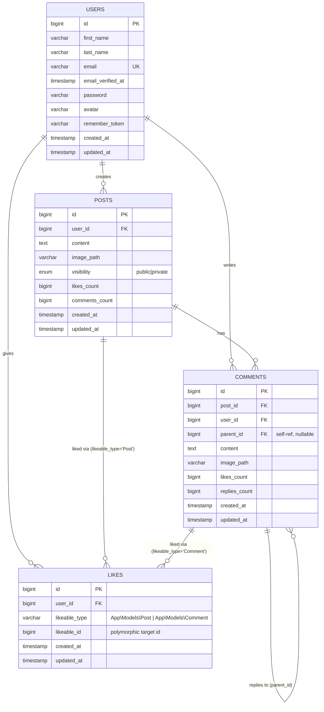

# AppifyBook — Social Feed

A full-stack social feed application built to the provided **Login / Register / Feed** designs.

## Features 
- Login and Registration with frontend and Backend validation.
- Social Feed with posts, comments, likes, and replies.
- Image upload for posts and comments.
- User authentication using Laravel Passport (JWT access tokens).
- Clean and modern UI with Bootstrap 5 and Task CSS.

## Architecture/Technology Stack 
- Backend: 
    - Laravel 12 + Laravel Passport (OAuth2 / JWT access tokens) + MySQL
    - CursorPagination for infinite scroll.
    - Service, Repository Pattern for clean business logic.
    - SOLID Principles for clean code.

- Frontend: 
    - React 19 + Vite + Axios + React Router


## Installation

### Backend

```bash
cd backend
composer install
cp .env.example .env
php artisan key:generate
php artisan passport:install
php artisan migrate
php artisan db:seed
php artisan serve --port 6063
```

### Frontend

```bash
cd frontend
npm install
npm run dev
```

## Core Schema ER Diagram

Covers the four major tables: `users`, `posts`, `comments`, `likes`.

> Note: `likes` is a **polymorphic** table (`likeable_type` + `likeable_id`), so it can reference either `posts` or `comments`. Mermaid has no native polymorphic-association notation, so both relationships are drawn explicitly with a comment noting the actual FK mechanism.



## Key constraints reflected above

- `posts.user_id` → `users.id`, `ON DELETE CASCADE`
- `comments.post_id` → `posts.id`, `ON DELETE CASCADE`
- `comments.user_id` → `users.id`, `ON DELETE CASCADE`
- `comments.parent_id` → `comments.id` (self-referencing, nullable, `ON DELETE CASCADE`) — enables threaded replies
- `likes.user_id` → `users.id`, `ON DELETE CASCADE`
- `likes` has a composite unique key on `(user_id, likeable_id, likeable_type)` — prevents duplicate likes on the same target by the same user
- `likes_count` / `comments_count` / `replies_count` are denormalized counters on `posts`/`comments`, not derived via SQL joins — kept in sync at the application layer

## Project Structure (Major Only)

```
appify-book/
├── backend/                    # Laravel 12 + Passport
│   ├── app/
│   │   ├── Http/Controllers/  # API controllers
│   │   ├── Models/            # Eloquent models
│   │   ├── Repositories/      # Repository pattern
│   │   ├── Services/          # Business logic services
│   │   └── Providers/         # AuthServiceProvider, etc.
│   ├── database/
│   │   ├── migrations/        # DB migrations
│   │   ├── seeders/           # DB seeders
│   │   └── factories/         # Model factories
│   ├── routes/                # API routes (api.php)
│   ├── config/                # App configuration
│   ├── public/                # Public assets
│   └── artisan                # Laravel CLI entry point
│
├── frontend/                   # React 19 + Vite
│   ├── src/
│   │   ├── api/               # Axios API clients
│   │   ├── components/        # Reusable React components
│   │   ├── pages/             # Page-level components
│   │   ├── contexts/          # React Context providers
│   │   ├── hooks/             # Custom React hooks
│   │   ├── assets/            # Static assets (images, etc.)
│   │   └── App.jsx            # Root component
│   ├── public/                # Static assets
│   └── vite.config.js         # Vite config
│
└── README.md                  # This file
```

## Authentication flow

1. `POST /api/register` or `POST /api/login` → returns `{ user, token }`.
2. The SPA stores the token in `localStorage` and sends it as `Authorization: Bearer <token>`.
3. Protected routes use the `auth:api` middleware (Passport guard).
4. `POST /api/logout` revokes the current token.

Passport token lifetimes are configured in `AppServiceProvider`: access tokens 7 days, refresh 30 days.

---

## API reference

All protected endpoints require `Authorization: Bearer <token>` and `Accept: application/json`.

### Auth
| Method | Endpoint | Body | Notes |
|---|---|---|---|
| POST | `/api/register` | first_name, last_name, email, password, password_confirmation | Returns user + token |
| POST | `/api/login` | email, password | Returns user + token |
| GET  | `/api/me` | — | Current user |
| POST | `/api/logout` | — | Revokes token |

### Posts
| Method | Endpoint | Notes |
|---|---|---|
| GET  | `/api/posts` | Cursor-paginated feed (10/page), newest first, visibility-filtered |
| POST | `/api/posts` | `multipart/form-data`: content?, image?, visibility. Needs text or image |
| GET  | `/api/posts/{post}` | Single post (403 if private & not owner) |
| DELETE | `/api/posts/{post}` | Author only |

### Comments
| Method | Endpoint | Notes |
|---|---|---|
| GET  | `/api/posts/{post}/comments` | Top-level comments + nested replies, paginated |
| POST | `/api/posts/{post}/comments` | Body: content, parent_id? (reply). Rejects replies-to-replies |
| DELETE | `/api/comments/{comment}` | Author only; adjusts counters |

### Likes
| Method | Endpoint | Notes |
|---|---|---|
| POST | `/api/posts/{post}/like` | Toggle. Returns `{ liked, likes_count }` |
| POST | `/api/comments/{comment}/like` | Toggle. Returns `{ liked, likes_count }` |
| GET  | `/api/posts/{post}/likers` | Users who liked the post |
| GET  | `/api/comments/{comment}/likers` | Users who liked the comment/reply |

---

## Frontend architecture

- **`AuthContext`** — holds the current user, hydrates from `/api/me` on boot if a token exists, exposes `login/register/logout`.
- **`ProtectedRoute`** — gates `/feed`, redirecting to `/login` when unauthenticated.
- **`api/client.js`** — axios instance with request (attach token) and response (`401` → logout) interceptors.
- **`Feed`** — cursor-based infinite scroll via `IntersectionObserver`.
- **`Post` / `Comment`** — optimistic like toggles; `Comment` recurses one level for replies.
- **`LikersModal`** — lazy-loads the likers list for any entity.

Styling reuses the **provided Buddy Script theme** verbatim (`public/assets/css`), with a small supplemental stylesheet (`src/styles/app.css`) for interactive states the static template didn't cover.


## What I'd add with more time

- **Real-time updates** (WebSockets/Laravel Echo) for live likes & comments.
- **Rate limiting** on write endpoints and image-processing/thumbnails on upload.
- **Feed fan-out / caching** (Redis) for very high read volume.
- **Cursor pagination for comments** (currently page-based) if threads get large.
- **Automated tests** (Pest/PHPUnit for the API, Vitest/RTL for components).